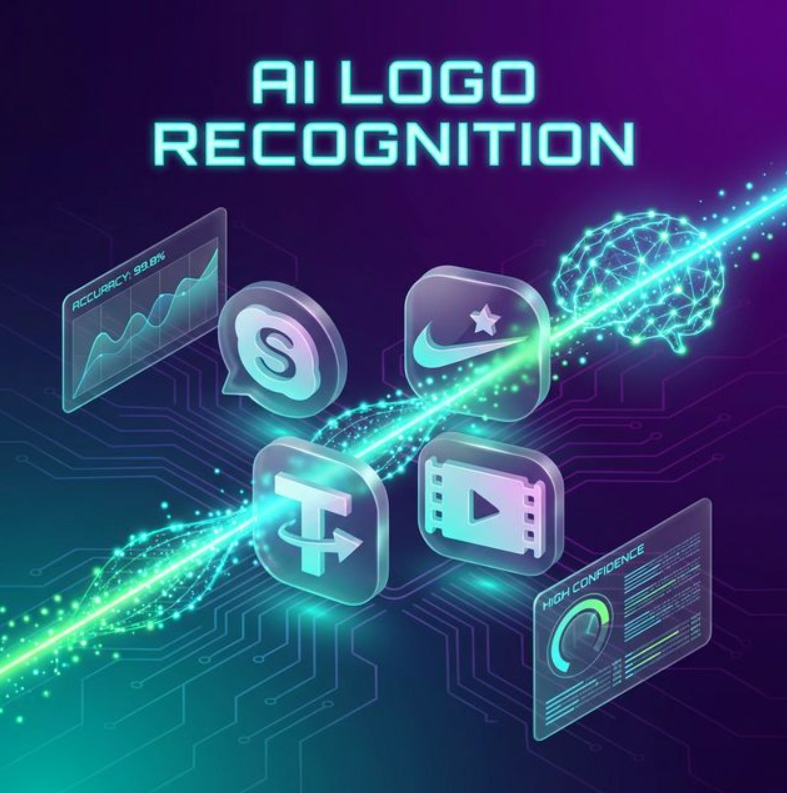

# 🔍🧠 BRAND-SPOTTER: AI Logo Recognition 🧠🔍

[](https://git.io/typing-svg)


[](https://brand-spotter-projecttt.streamlit.app/)
[](https://github.com/mayank-goyal09/Brand-Spotter/stargazers)

---

<p align="center">
  
</p>

---

### 🔍 **Classify brand logos with 97%+ accuracy using just ~50 images per class** 🎯

### 🧠 Transfer Learning × MobileNetV2 = **Micro-Data Mastery** 💪

---

## 📖 **THE STORY: A JOURNEY OF CHALLENGES & SOLUTIONS** 📖

> **"This project wasn't just about building a model—it was about overcoming real-world ML obstacles and discovering how AI can accelerate development."**

This README tells the authentic story of how `Brand-Spotter` was built, the **hardships faced**, the **lessons learned**, and how **AI-powered coding (Antigravity)** transformed the development process.

---

## 🚧 **THE PROBLEM VS THE SOLUTION** 🚧

<p align="center">
  
</p>

<table>
<tr>
<td width="50%">

### 😰 **The Initial Challenge**

When I started this project, I had a simple goal:
> *Build a CNN to classify logos (Facebook, Google, Nike, YouTube).*

But there was a **massive problem**:

| 🔴 Challenge | Impact |
|-------------|--------|
| **Only ~14 images per class** | Not enough data for a CNN to learn |
| **Custom CNN from scratch** | Overfitting within 5 epochs |
| **Validation accuracy stuck at ~60%** | Model was guessing, not learning |

**The harsh reality**: Deep learning typically needs **thousands** of images per class. I had **14**. 💀

</td>
<td width="50%">

### ❓ **Why It Failed**

My first approach was a **simple custom CNN**:

```python
# ❌ MY ORIGINAL (FAILED) APPROACH
x = layers.Conv2D(32, 3, activation="relu")(x)
x = layers.MaxPooling2D(2)(x)
x = layers.Conv2D(64, 3, activation="relu")(x)
x = layers.MaxPooling2D(2)(x)
x = layers.Conv2D(128, 3, activation="relu")(x)
x = layers.Flatten()(x)  # ← MISTAKE!
x = layers.Dense(128, activation="relu")(x)
```

**What went wrong:**
- ❌ Training from scratch with 14 images
- ❌ Using `Flatten()` (huge parameters, no spatial info)
- ❌ Weak data augmentation
- ❌ No callbacks (early stopping, LR scheduling)
- ❌ Single-stage training

**Result**: Model memorized training data → failed on validation.

</td>
</tr>
</table>

---

## 💡 **THE BREAKTHROUGH: TRANSFER LEARNING** 💡

<p align="center">
  
</p>

### 🧠 **The Solution: Stand on the Shoulders of Giants**

Instead of training from scratch, I used **MobileNetV2** (pre-trained on 1.4 million ImageNet images). This model already knows:
- ✅ How to detect edges, textures, shapes
- ✅ How to recognize patterns and objects
- ✅ General visual features that transfer to logos!

```python
# ✅ THE WINNING APPROACH
base_model = MobileNetV2(weights="imagenet", include_top=False)
base_model.trainable = False  # Stage 1: Freeze

x = base_model(x, training=False)
x = GlobalAveragePooling2D()(x)  # ← CORRECT!
x = BatchNormalization()(x)
x = Dropout(0.5)(x)
x = Dense(num_classes, activation="softmax")(x)
```

### 🔄 **Two-Stage Training Strategy**

| **Stage** | **What Happens** | **Learning Rate** |
|-----------|------------------|-------------------|
| **Stage 1** | Freeze MobileNetV2, train only top layers | `1e-3` (high) |
| **Stage 2** | Unfreeze top 30 layers, fine-tune | `1e-5` (very low) |

This approach prevents **catastrophic forgetting** and allows the model to adapt to logos without destroying pre-trained knowledge.

---

## 🔬 **HOW IT WORKS: THE PIPELINE** 🔬

<p align="center">
  
</p>

### **Pipeline Breakdown:**

1️⃣ **Raw Logo Images** → Input dataset with 4 brand classes  
2️⃣ **Data Augmentation** → Rotation, flip, zoom, contrast adjustments  
3️⃣ **MobileNetV2** → Pre-trained feature extraction backbone  
4️⃣ **Fine-tuning** → Transfer learning + optimize weights  
5️⃣ **Prediction Output** → 98% confidence classification  

---

## 🧠 **THE NEURAL NETWORK BRAIN** 🧠

<p align="center">
  
</p>

The model learns to recognize brand logos by leveraging patterns learned from millions of ImageNet images. The neural network acts as an intelligent "brain" that can identify visual patterns unique to each brand.

---

## 🛠️ **TECH STACK** 🛠️


| **Category** | **Technologies** |
|--------------|------------------|
| 🐍 **Language** | Python 3.10+ |
| 🧠 **Deep Learning** | TensorFlow 2.x, Keras |
| 🏗️ **Architecture** | MobileNetV2 (Transfer Learning) |
| 🎨 **Frontend** | Streamlit (Glassmorphism UI) |
| 📊 **Visualization** | Matplotlib, Plotly |
| 🔧 **Preprocessing** | Pillow, NumPy |
| 🚀 **Deployment** | Streamlit Cloud |

---

## 📂 **PROJECT STRUCTURE** 📂

```
🔍 Brand-Spotter/
│
├── 📁 assets/                     # README images
├── 📁 data/logos_small/           # Dataset (Train/Val splits)
│   ├── train/                     # Training images by class
│   └── val/                       # Validation images by class
├── 🎨 app.py                      # Streamlit web application
├── 📓 main_new.ipynb              # Improved training notebook (Transfer Learning)
├── 📓 main.ipynb                  # Original failed experiment
├── 🧠 logo_classifier_final.keras # Trained model file
├── 📦 requirements.txt            # Dependencies
└── 📖 README.md                   # You are here! 🎉
```

---

## 🚀 **QUICK START** 🚀

### **Step 1: Clone the Repository** 📥

```bash
git clone https://github.com/mayank-goyal09/Brand-Spotter.git
cd Brand-Spotter
```

### **Step 2: Install Dependencies** 📦

```bash
pip install -r requirements.txt
```

### **Step 3: Run the App** 🎯

```bash
streamlit run app.py
```

### **Step 4: Open in Browser** 🌐

The app will open at: **`http://localhost:8501`**

---

## 🎨 **APP FEATURES** 🎨

<table>
<tr>
<td>

### 📤 **Upload Mode**
- Drag & drop any logo image
- Supports PNG, JPG, JPEG
- Handles transparent backgrounds

</td>
<td>

### 🖼️ **Gallery Mode**
- Pre-loaded sample images
- Instant one-click testing
- No uploads needed!

</td>
<td>

### 📊 **Rich Results**
- Confidence score bar
- Probability distribution chart
- Glassmorphism UI design

</td>
</tr>
</table>

### ✨ **Premium UI Features**

- 🌈 **Animated Gradient Background**
- 💎 **Glassmorphism Cards**
- ⚡ **Neon Typography**
- 📱 **Mobile Responsive**
- 🌙 **Dark Theme**

---

## 📊 **MODEL PERFORMANCE** 📊

| **Metric** | **Value** | **Notes** |
|------------|-----------|-----------|
| **Validation Accuracy** | **97.6%** | After fine-tuning |
| **Training Images** | ~14 per class | Micro-dataset! |
| **Classes** | 4 | Facebook, Google, Nike, YouTube |
| **Input Size** | 160×160 | RGB |
| **Parameters** | ~2.3M | MobileNetV2 + custom head |

### **Data Augmentation Applied:**
- ↔️ Random Horizontal + Vertical Flip
- 🔄 Random Rotation (±30°)
- 🔍 Random Zoom (±30%)
- 🌓 Random Contrast & Brightness
- ↕️ Random Translation

---

## 🤖 **THE ROLE OF AI (ANTIGRAVITY) IN THIS PROJECT** 🤖

### 🚀 **Why I Used AI-Powered Development**

After struggling with the failing custom CNN, I turned to **Antigravity (AI Coding Assistant)** to accelerate my development:

| **Challenge I Faced** | **How AI Helped** |
|-----------------------|-------------------|
| ❌ CNN overfitting badly | ✅ Suggested Transfer Learning approach |
| ❌ Didn't know optimal architecture | ✅ Designed 2-stage training pipeline |
| ❌ Preprocessing mismatch (0-1 vs -1,1) | ✅ Debugged the `preprocess_input` issue |
| ❌ RGBA images breaking the model | ✅ Added robust alpha channel handling |
| ❌ Wanted a stunning UI | ✅ Created glassmorphism Streamlit app |

### 💬 **Key Learnings from AI Collaboration:**

1. **Transfer Learning is essential for micro-datasets** — I wouldn't have discovered this optimization path as quickly on my own.
2. **Preprocessing MUST match training** — The AI caught that I was using `/255.0` instead of `preprocess_input()`, which was why "everything predicted as Nike."
3. **Debugging is faster** — The RGBA→RGB bug took AI 30 seconds to diagnose what could have taken me hours.

> **Verdict**: AI didn't *replace* my learning—it **accelerated** it. I now understand transfer learning, fine-tuning, and preprocessing deeply because I saw the *why* behind each fix.

---

## 📚 **SKILLS DEMONSTRATED** 📚

- ✅ **Transfer Learning** — MobileNetV2 feature extraction
- ✅ **Fine-Tuning** — Two-stage training strategy
- ✅ **Data Augmentation** — Aggressive augmentation for small datasets
- ✅ **Preprocessing Pipelines** — Matching training/inference preprocessing
- ✅ **Keras Functional API** — Custom model architecture
- ✅ **Callbacks** — EarlyStopping, ReduceLROnPlateau, ModelCheckpoint
- ✅ **Web Development** — Streamlit with custom CSS
- ✅ **Problem Solving** — Debugging channel mismatches, preprocessing bugs
- ✅ **AI-Assisted Development** — Using AI tools effectively

---

## 🔮 **FUTURE ENHANCEMENTS** 🔮

- [ ] Add more brand classes (Adidas, Puma, Apple, etc.)
- [ ] Implement confidence thresholding for "Unknown" logos
- [ ] Add Grad-CAM visualization to show model attention
- [ ] Deploy on Hugging Face Spaces for wider reach
- [ ] Create a mobile app version (TensorFlow Lite)
- [ ] Add real-time webcam logo detection

---

## 🤝 **CONTRIBUTING** 🤝

Contributions are **always welcome**! 🎉

1. 🍴 Fork the Project
2. 🌱 Create your Feature Branch (`git checkout -b feature/NewBrand`)
3. 💾 Commit your Changes (`git commit -m 'Add Adidas logo class'`)
4. 📤 Push to the Branch (`git push origin feature/NewBrand`)
5. 🎁 Open a Pull Request

---

## 📝 **LICENSE** 📝

Distributed under the **MIT License**. See `LICENSE` for more information.

---

## 👨‍💻 **CONNECT WITH ME** 👨‍💻

[](https://github.com/mayank-goyal09)
[](https://www.linkedin.com/in/mayank-goyal-4b8756363/)
[](mailto:itsmaygal09@gmail.com)

**Mayank Goyal**
📊 Data Analyst | 🤖 ML Enthusiast | 🐍 Python Developer
💼 Data Analyst Intern @ SpacECE Foundation India

---

## ⭐ **SHOW YOUR SUPPORT** ⭐

Give a ⭐️ if this project taught you something about **transfer learning** and **micro-dataset challenges**!

### 🔍 **Built with Persistence, Transfer Learning & AI-Powered Development** 🔍

**"From 60% accuracy failure to 97% success—proof that the right approach beats more data."** 🚀

---


